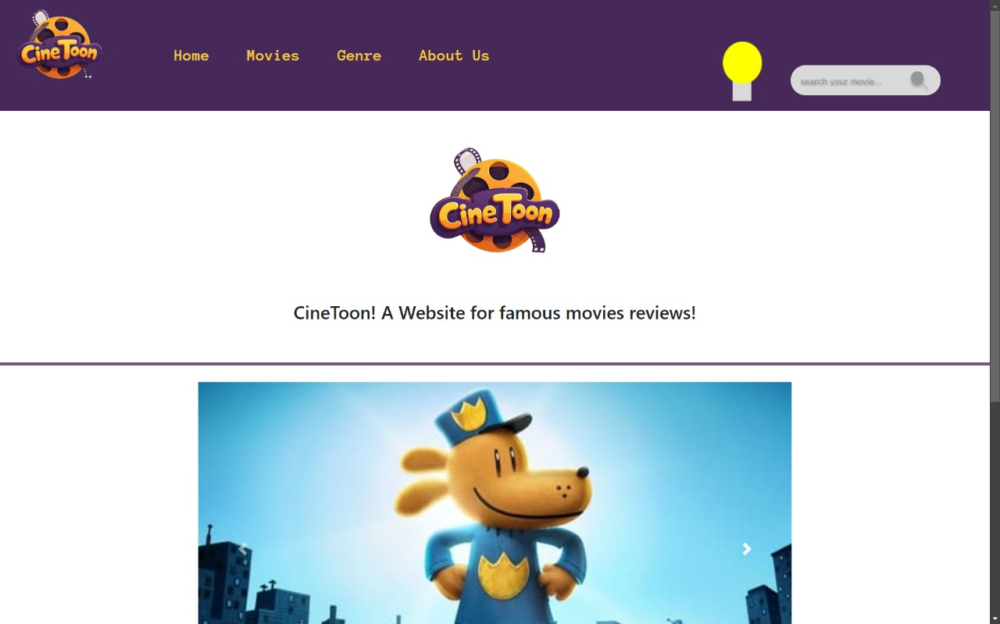
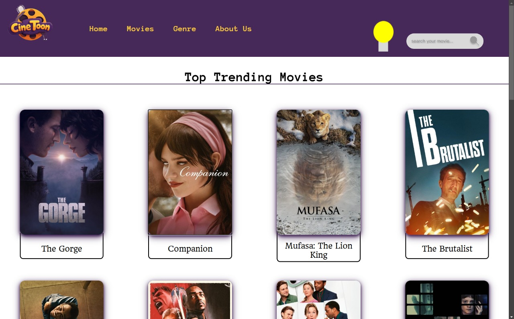
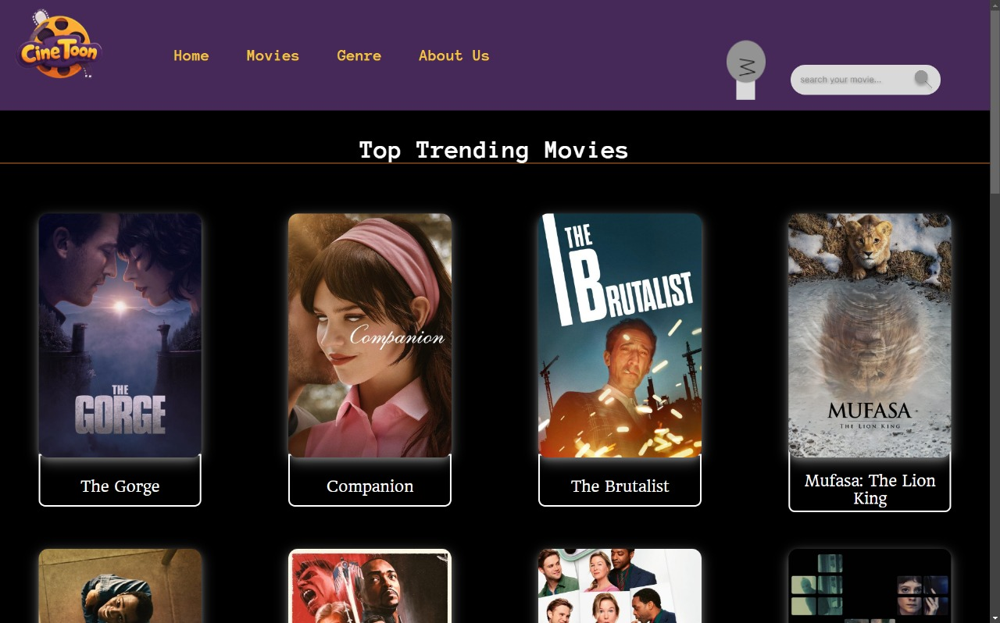
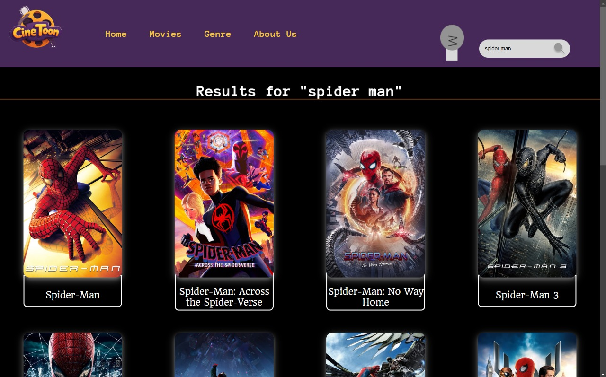

# 🎬 Movie & TV Website  

This is a **Movie & TV website** developed as a **college project**, utilizing an external API to fetch and display real-time data. The platform provides users with an intuitive interface to explore movies and TV shows dynamically.  

## 🚀 Features  
- 🔍 **Search** for movies by name  
- 📄 View **detailed descriptions** of movies and TV shows  
- 🎞️ See **high-quality posters**  
- ⭐ Check **ratings**  
- 🎭 Browse by **genres**  
- 🌙☀️ Toggle between **dark and light mode**  

## 🛠️ Technologies Used  
- **JavaScript**  
- **HTML & CSS**  
- **API TheMOVIEDB**  

## 📷 Screenshots  

  

  

  

  
